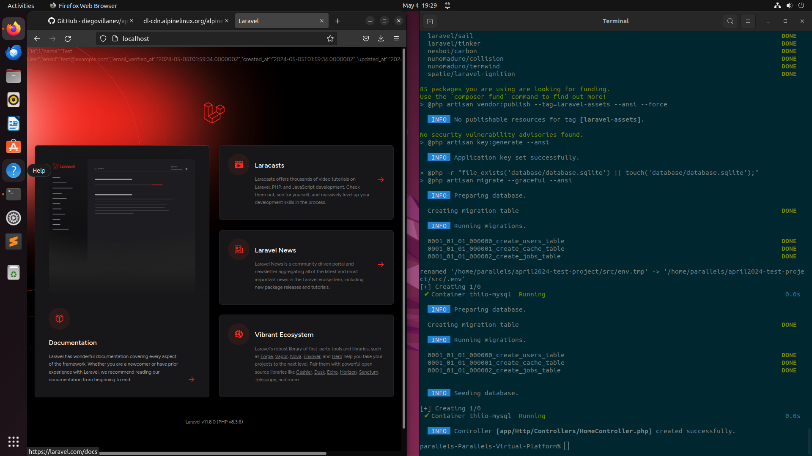

# april2024-test-project
Un ambiente genérico implementando un archivo Docker compose con 4 servicios.

## Instrucciones

Requisitos:
  * Una VM recién levantada con Docker instalado
  * Permisos de ejecución en el script `install.sh` (Ya debería tenerlos).

Para empezar los servicios, hay que ejecutar el script de la siguiente forma: `./install.sh`. El script detectará
automáticamente cuales archivos docker compose y Dockerfiles debe ejecutar dependiendo del usuario que los está ejecutando,
para después crear el proyecto dummy de Laravel, levantar la BD y hacer modificaciones al proyecto para poder hacer la
conexión y traer un registro.

El orden de ejecución del script es el siguiente:
  1. Levantar la App Laravel mediante sus 3 servicios principales: Nginx, PHP y MySQL, y 2 secundarios: Redis y Mailhog (dependencias de Laravel)
  2. Estos servicios necesitan sus propios servicios dependientes, que son las herramientas necesarias para levantar el proyecto: Composer, Artisan y NPM
  3. Una vez que los servicios esten arriba, hacer _scaffolding_ del proyecto Laravel usando el servicio efímero de Composer
  4. Modificar el proyecto para que se pueda conectar a nuestra BD MySQL y para que pueda imprimir un registro.

La forma en la que está diseñada el uso de lo servicios nos permite usar los comandos de Composer, Artisan y NPM sin tenerlos instalados en local. Si es necesario utilizar, se puede correr efímeramente mediante:

  * `docker-compose run --rm composer ...`
  * `docker-compose run --rm npm ...`
  * `docker-compose run --rm artisan ...`

Si es es necesario modificar los scripts o archivos y tener que volver a levantar el proyecto, tan sólo hay que usar:

`docker compose down && ./install.sh`

## Prueba de concepto

